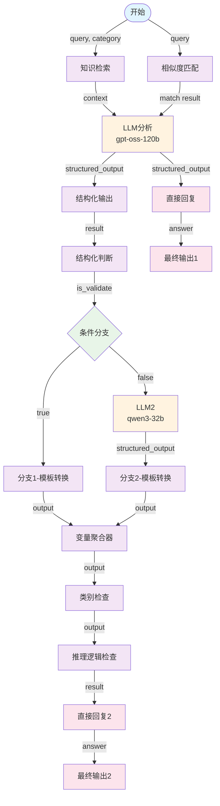

# 分类分级工作流

## 1. 当前dify流程

### 1.1 整体流程

1. **输入阶段（Start 节点）**
   - 输入参数：`query`（表及字段信息），`category`（目标类别列表）。
2. **知识增强（知识检索节点）**
   - 根据 `query` 从知识库检索相关规范/分类规则，作为大模型推理的上下文。
3. **相似度匹配（Code 节点）**
   - 调用外部接口，对输入 query 与历史/参考分类做相似度匹配，补充或修正。
4. **初步分类分级（LLM 节点）**
   - 调用大模型（gpt-oss-120b），输出结构化 JSON：
     - 字段级（类别、级别、推理逻辑、置信度、模型标识）
     - 表级（类别、级别、推理逻辑、置信度、模型标识）
5. **第一轮输出（Answer 节点）**
   - 将 LLM 输出作为初步答案。
6. **结构化检查（Code 节点）**
   - 检查 LLM 输出是否满足 JSON Schema 要求：
     - 必需字段是否存在（columnName, columnLevel 等）
     - `columnInfoList` 是否为数组
     - 若缺失则报错或给出修正建议。
7. **条件分支（If-Else 节点）**
   - ✅ 校验通过 → 直接进入「模板转换」→ 聚合结果。
   - ❌ 校验失败 → 走第二个 LLM（qwen3-32b），根据错误提示和知识库补齐缺失字段，再进入聚合。
8. **类别有效性检查（Code 节点）**
   - 验证输出的 `tableClassifications` 和 `columnClassifications` 是否在合法类别集合中。
   - 若不合法，则调用 embedding 相似度替换为最接近的合法类别。
   - 将分类字段统一转换为数组形式。
9. **推理逻辑清理（Code 节点）**
   - 删除 placeholder（如 `{目标类别}`、`{数据敏感性}` 等占位符）。
   - 生成最终干净可用的 JSON 输出。
10. **最终输出（Answer 节点）**
    - 输出整理好的结果 JSON，保证符合 schema，且分类合规。




### 1.2 必要逻辑 vs. 可简化逻辑

必要逻辑

- **大模型分类分级（LLM）** → 这是核心任务。
- **知识检索** → 用于保证分类/分级有依据。
- **相似度匹配** → 用于对历史结果进行召回。
- **结构化校验** → 确保输出符合 schema，避免脏数据。
- **类别有效性检查** → 保证所有分类都在合法枚举集合中。
- ~~**推理逻辑清理** → 去掉模板占位符，保证结果可读可用。~~

可简化逻辑（可合并）

- **双路分支（If-Else + 第二个 LLM）**
  - 目前是：先校验 → 不通过就再跑一次大模型补全。
  - 在 Spring AI/ADK 里，可以直接 **一次调用模型+schema 校验**（失败就报错），不必两次模型调用。
- **多次模板转换/变量聚合**
  - Dify 工作流需要节点化，Spring AI/ADK 中可以在一段代码里完成（拼接/格式化/聚合）。
- **相似度匹配外部接口**
  - 如果 `category` 已经固定，可以直接在 ADK 内部做 embedding 近邻替换，不需要额外 HTTP 调用。


## 2.  saa的实现逻辑

```uml
@startuml parallel_translator_and_expander_flow
skinparam usecaseFontSize 14
skinparam usecaseStereotypeFontSize 12
skinparam hexagonFontSize 14
skinparam hexagonStereotypeFontSize 12
title "parallel translator and expander flow"
footer

powered by spring-ai-alibaba
end footer
circle start<<input>> as __START__
circle stop as __END__
usecase "similarityMatch"<<Node>>
usecase "knowledgeRetrieval"<<Node>>
usecase "classification"<<Node>>
usecase "categoryValidation"<<Node>>
usecase "structuredValidation"<<Node>>
hexagon "check state" as condition1<<Condition>>
"__START__" -down-> "similarityMatch"
"__START__" -down-> "knowledgeRetrieval"
"similarityMatch" -down-> "classification"
"knowledgeRetrieval" -down-> "classification"
"classification" -down-> "structuredValidation"
"structuredValidation" .down.> "condition1"
"condition1" .down.> "categoryValidation": "yes"
'"structuredValidation" .down.> "categoryValidation": "yes"
"condition1" .down.> "classification": "no"
'"structuredValidation" .down.> "classification": "no"
"categoryValidation" -down-> "__END__"
@enduml

```

133相似度匹配接口

```json
# 请求
curl --location --request POST 'http://10.191.23.133:8899/match' \
--header 'Content-Type: application/json' \
--data-raw '{
  "inputs": {
    "query": "{\"columnInfoList\":[{\"columnName\":\"month_id\",\"columnComment\":\"月份\",\"id\":8388546},{\"columnName\":\"device_number\",\"columnComment\":\"电话号码\",\"id\":8388551},{\"columnName\":\"out_sms_num\",\"columnComment\":\"发送短信数\",\"id\":8388553},{\"columnName\":\"total_sms_num\",\"columnComment\":\"总短信数\",\"id\":8388554},{\"columnName\":\"day_id\",\"columnComment\":\"日\",\"id\":8388557}],\"dataItems\":[],\"dbId\":4482,\"flag\":false,\"id\":55520,\"resultSource\":\"0\",\"succeeded\":false,\"tbName\":\"DWA_S_D_CUS_CB_PP_SMS\",\"tbComment\":\"综采cBss业务单用户短信表(日)\"}",
    "threshold": 0.6,
    "topN": 2
  }
}'

# 响应
{
  "字段信息": [
    {
      "字段名": "month_id",
      "描述": "月份",
      "历史相似字段": [
        {
          "字段名": "",
          "描述": "月总人数",
          "类别": "U2-7-2用户上网行为相关统计分析数据",
          "级别": "第三级",
          "相似度": 0.7533
        },
        {
          "字段名": "",
          "描述": "月系数",
          "类别": "U2-7-2用户上网行为相关统计分析数据",
          "级别": "第三级",
          "相似度": 0.7248
        }
      ],
      "匹配数量": 2
    },
    {
      "字段名": "device_number",
      "描述": "电话号码",
      "历史相似字段": [
        {
          "字段名": "",
          "描述": "电话号码",
          "类别": "U1-1-2网络身份标识",
          "级别": "第三级",
          "相似度": 0.9614
        },
        {
          "字段名": "",
          "描述": "用户电话号码",
          "类别": "U1-1-2网络身份标识",
          "级别": "第三级",
          "相似度": 0.9371
        }
      ],
      "匹配数量": 2
    },
    {
      "字段名": "out_sms_num",
      "描述": "发送短信数",
      "历史相似字段": [
        {
          "字段名": "",
          "描述": "发送短信条数",
          "类别": "U2-7-1用户使用习惯和行为分析数据",
          "级别": "第三级",
          "相似度": 0.9811
        },
        {
          "字段名": "",
          "描述": "短信-发送短信条数",
          "类别": "U2-7-1用户使用习惯和行为分析数据",
          "级别": "第三级",
          "相似度": 0.9638
        }
      ],
      "匹配数量": 2
    },
    {
      "字段名": "total_sms_num",
      "描述": "总短信数",
      "历史相似字段": [
        {
          "字段名": "",
          "描述": "总短信条数",
          "类别": "U2-7-1用户使用习惯和行为分析数据",
          "级别": "第三级",
          "相似度": 0.9726
        },
        {
          "字段名": "",
          "描述": "短信-总短信条数",
          "类别": "U2-7-1用户使用习惯和行为分析数据",
          "级别": "第三级",
          "相似度": 0.9508
        }
      ],
      "匹配数量": 2
    },
    {
      "字段名": "day_id",
      "描述": "日",
      "历史相似字段": [
        {
          "字段名": "",
          "描述": "日dd",
          "类别": "E3-3-4生产经营数据",
          "级别": "第三级",
          "相似度": 0.9157
        },
        {
          "字段名": "",
          "描述": "日期",
          "类别": " E1-3-7运维日志",
          "级别": "第三级",
          "相似度": 0.8135
        }
      ],
      "匹配数量": 2
    }
  ],
  "表信息": [
    {
      "表名": "DWA_S_D_CUS_CB_PP_SMS",
      "描述": "",
      "历史相似表": [],
      "匹配数量": 0
    }
  ],
  "搜索参数": {
    "相似度阈值": 0.6,
    "最大返回数": 2,
    "搜索方法": "Range Search"
  }
}
```

### 待办

1. 模型替换为maas；

2. ~~新增格式化校验节点【done】~~

   ~~目前在提示词里有输出格式规范了， 经测试， 输出内容也符合格式要求；~~

   ~~后续可加一个代码强校验， 更保险；~~

3. 目前的**rag**基于内存存储，需要对接milvus， 以及目前的**知识库文档**是我自己清洗的， 需要改为丝雨、英杰提供的文档;

4. 需进行集成验证【将本服务Docker部署到开发环境， 替换dify工作流进行流程集成， 需考虑开发环境与mass的连通性】；

5. 流程优化

   - 目前提示词太过冗余/复杂, 影响模型的输出效率， 需改进prompt；

   - 相似度匹配节点可改为another rag节点， 省掉http调用以及python服务的部署；

   - 目前来看qwen-max的输出已经是结构化/类别正确的结果， 不需要scheme验证和类别验证节点， 可以考虑简化流程， 但不确定mass平台的模型效果；

     流程需和模型绑定测试；

   

